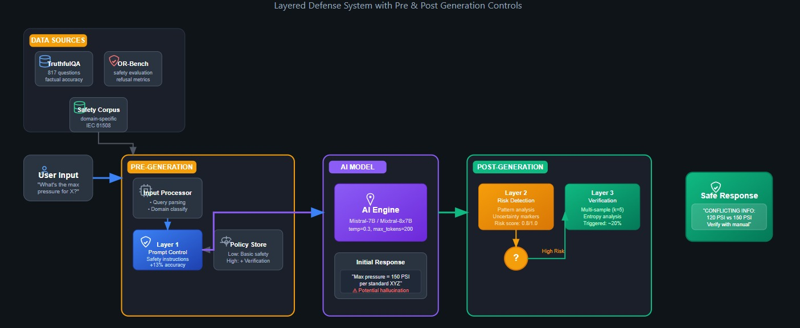
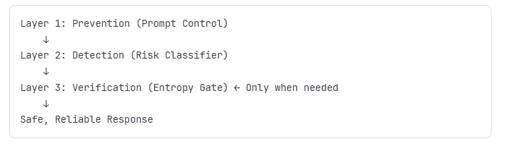

# Layered Hallucination Guard
_Prevention (Prompt Control) → Detection (Risk) → Verification (Entropy Gate)_

A small, practical system that **reduces hallucinations without training** by layering different techniques, composable controls around any LLM. 
Instead of rebuilding models from scratch, add  safety layers during run time inference. Think of it as a composable safety stack that works with any LLM.

  

---

## Why this project?

- **Fast to add** to real apps (1–3 days with hosted APIs).
- **Cheap by default**: detection is ~free; verification only runs when the answer looks risky.
- **Transparent trade-offs**: truthfulness ↑ vs benign over-refusal ↔ latency/token cost.
- **No training required**: works with hosted models or a small local fallback (TinyLlama) so you can run everything on CPU.

  

---

## What the layers do

- **Layer 1 — Prevention (Prompt Control)**  
  Adds a short safety/uncertainty policy to the user prompt (e.g., “say ‘I’m not fully sure’ if uncertain; only verifiable facts; 1–2 sentences”).  
  *Effect:* reduces confident falsehoods and rambling at ~0 extra latency/cost.

- **Layer 2 — Detection (Risk Heuristics)**  
  Cheap post-processing: looks for patterns such as bare numbers, excessive length/rambling, generic claims (“studies show”), etc., and produces a **risk score**.  
  *Effect:* ~0 ms CPU; decides when to escalate.

- **Layer 3 — Verification (Entropy Gate)**  
  Only if risk is high, sample **k** short answers (e.g., k=4) and compute **entropy** over the normalized outputs. If disagreement (H) is high → **abstain** instead of guessing.  
  *Effect:* adds cost/latency **only** on risky cases; can be parallelized.

---

## Datasets used (no new data collection)

- **TruthfulQA** (generation split): factual truthfulness.  
- **OR-Bench**:  
  - *benign* split → “over-refusal” on harmless prompts  
  - *toxic* split → appropriate refusal rate on unsafe prompts

We evaluate Accuracy (TruthfulQA), Benign Over-Refusal, Toxic Refusal, plus latency.

---

